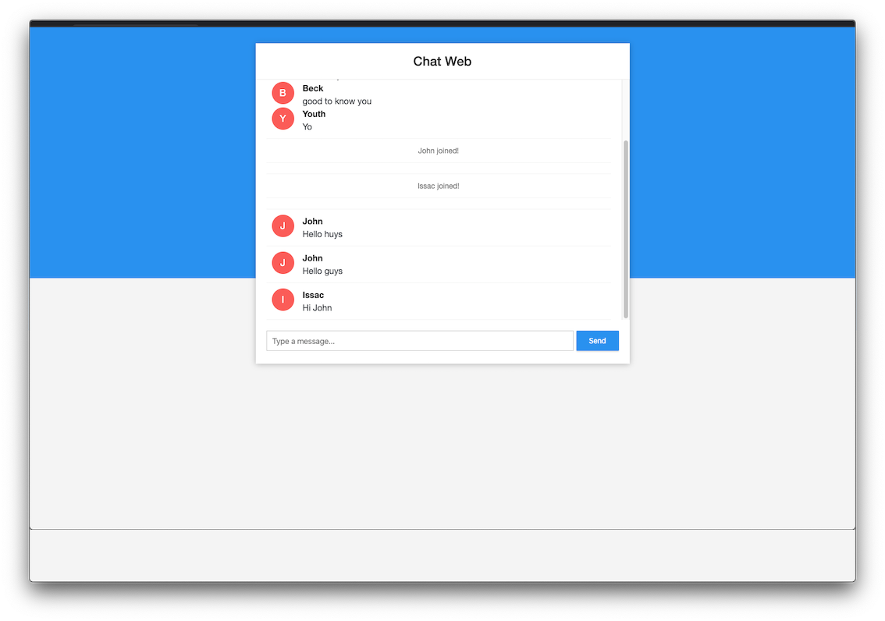

## Spring Boot WebSocket Chat Web

It's a sample web chat application demonstrate springboot websocket feature and JDBC integration. 



## Requirements

1. Java - 1.8.x

2. Maven - 3.x.x

## Steps to Setup

**1. Build and run the app using maven**

```bash
mvn package
java -jar target/websocket-demo-0.0.1-SNAPSHOT.jar
```

Alternatively, you can run the app directly without packaging it like so -

```bash
mvn spring-boot:run
```